# Gesture Recognition

## 1. A Review of the Hand Gesture Recognition System: Current Progress and Future Directions

IEEE Access 2020

### keywords

Classification, feature extraction, dynamic hand gesture recognition, sign language recognition, vision-based hand gesture, recognition accuracy

### abstract

aiming at the progress of sign language research in the vision-based hand gesture recognition system from 2014 to 2020.

A total of 98 articles. And extract three critical aspects of the vision based hand gesture recognition: 1. data acquisition, data environment, and hand gesture representation.

After comparing different recognition method, for the singer dependent(characteristics or features of sign language that vary based on the individual signer.  In other words, sign language can have variations or idiosyncrasies based on the signer's regional background, personal style, or other factors. ), the e recognition accuracy ranges from 69% to 98%, with an average of 88.8%; s ranges from 48% to 97%, with an average of 78.2%. 

There's a lack in the progress of continuous gesture recognition.

### Ⅳ Findings

#### Issues

1. Data Acquisition and data environment

More than 80% had been conducted in a restricted laboratory environment. Using these database can always result in an over-fitted language model.

Challenge not solved: 1. unanticipated conditions. There's difficulty of separating objects in the background that are similar with the skin color. 2. sign variations: non-restricted background and different lighting conditions.

Recent focusing: real-life applicability, but the development of database are becoming more challenging as it should be larger.

2. Hand Gesture representations

Dynamic gesture speration:

1. Isolated gestures – the signers perform one sign gesture at a time. For example, the isolated gesture of Chinese Sign Language for the word ‘‘WELCOME’’ in [19]. 
2. Continuous gestures – the signer perform continuously the signs. For example, continuous gestures of Indian Sign Language for the sentence ‘‘IT IS CLOSED TODAY’’ [20]. 
3. Fingerspelling – the act of spelling out the letters of the alphabet in a word using hand. For example, fingerspelling of American Sign Language for word ‘‘TULIP’’ in [21] and alphabet ‘‘Z’’ in [22].

main problem: handling non-gesture movements

- movement epenthesis: as a noise(because no sign associated with them)
- coarticulation: the appearance of the end of the sign and the beginning of the next sign can be significantly different under different sentence contexts
- gesture spotting: different hand gesture and movements used for create the letters 

above problems have an effect on hand segmentation. And the  solution usually used is placing restrictions(restricted laboratory environment).

#### Progress

1. data acquisition method
   - Single camera – use of one camera at a time, such as video camera, digital camera, Webcam, or smartphone camera. 
   - Active techniques – use light projection to locate the hand and detect hand movement such as Microsoft Kinect camera and Leap Motion Controller 
   - Invasive techniques – use body markers like wrist bands or color gloves. 
   - Stereo camera – use multiple monocular cameras to capture images at the same time to provide depth informatio
2. databse
   - existing datasets:
     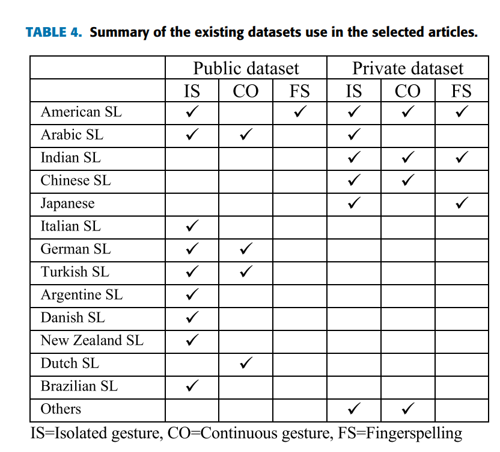
3. feature extraction

- Histogram of oriented gradient (HOG)
- Principal component analysis (PCA)
- Local binary pattern(LBP)
- Zernike moments
- Convolutional neural network(CNN)

4. classifier
   - SVM
   - Hidden markov model(HMM)
   - KNN
   - Random forest(RF)
   - Distance metrics
   - Neural network
   - Deep neural network/ deep learning(mostly CNN)
5. Hand Gesture representations

most works focused on recognizing isolated gestures at 67% compared to dynamic recognition for continuous gestures at only 21%. Only 12% of the works used fingerspelling words and alphabets

6. Parameters
   - Hand shape
   - Hand orientation
   - Hand location
   - Hand motion

#### Future directions

1. expand current feature set to support more gestures
2. solve the computational cost problem
3. using smart and wearable devices as data acquisition tool

## 2. A Comprehensive Review of Sign Language Recognition: Different Types, Modalities, and Datasets

Madhiarasan, Dr M., Prof Roy, and Partha Pratim. "A Comprehensive Review of Sign Language Recognition: Different Types, Modalities, and Datasets." *arXiv preprint arXiv:2204.03328* (2022).

2022 Total citation:3

### keywords

Artificial Intelligence, Sign Language Recognition, Datasets, and Human-Computer Interact

### Introduction

According to the WHO (World Health Organization) report, over 466 million people are speech or hearing impaired, and 80% of them are semi-illiterate or illiterate [1].

Below is a picture of the taxonomy of SLR.

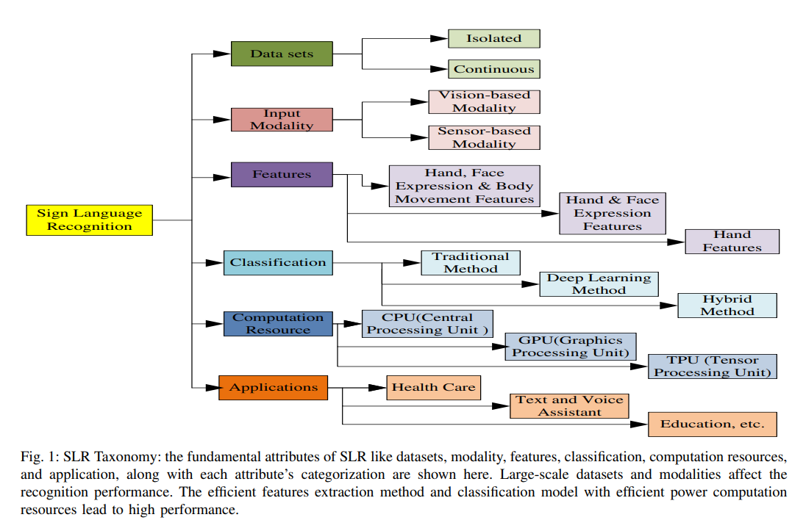

#### **Challenges**

SLR comprises gestures and facial expressions. To be more specific, which are hand movement, shape, position, orientation, palm posture, finger movement, facial expression, and body movements.

**Barrier and problem**

- Computation speed and time
  - Create complexity to the system and take a lot of computation time
- Scaling and image orientation problem
  - The distance of input data capturing various signers
- Illumination of light
  - Performance varies with different illumination scenarios because most models use the RGB model. It is highly illumination sensitive.
- Dynamic and non-uniform background environment
  - The noise, improper detection of hand, and face lead to affect the performance and mislead the sign recognition system

**Challenges and possible solutions**

- scaling and image orientation problems
  - using deep learning
- illumination problem
  - RGB is converted to HSV or Ycbcr
- dynamic and non-uniform background environment
  - skin region and background subtraction method

#### Procudure

Below figure shows the general process flow of SLR

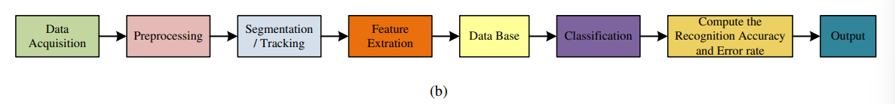

1. Data collection

There are mainly two methods: Vision and Sensor.

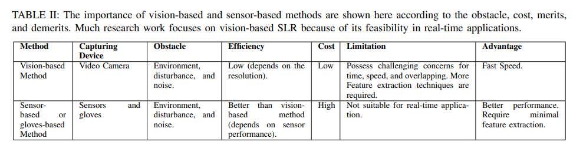

2. Image Preprocessing

dimension, reduction, normalization, and noise removal

3. Segmentation

purpose: splitting the image into various parts of ROI(region of interest)

solution:

- skin colour segmentation
- HTS hands tracking and segmentation
- entropy analysis 
- PIM picture information measure

4. tracking

- camshift(continuous adaptive mean shift used to track the head position)
  - CAMSHIFT, short for "Continuously Adaptive Mean Shift", is a computer vision algorithm used for object tracking. It is based on the Mean Shift algorithm and iteratively updates the target location by finding the maximum density of probability distribution in a given region of interest. It was initially used to track the human face, but it has since been adapted for other tracking tasks in computer vision.
- adaboost with HOG
  - AdaBoost with HOG (Histogram of Oriented Gradients) is a machine learning algorithm used for object detection and image recognition tasks. It combines the AdaBoost algorithm, which is a boosting algorithm that iteratively combines multiple weak classifiers to create a strong classifier, with HOG feature extraction, which computes the histogram of gradient directions in an image to capture local object appearance and shape. The resulting classifier is able to accurately detect and recognize objects in an image by identifying the presence of specific HOG features.
- particle filtering(KPF-Kalman Particle Filter)
  - Particle filtering, also known as Sequential Monte Carlo (SMC), is a type of probabilistic algorithm used to estimate the state of a system based on a sequence of noisy observations, such as tracking the position and velocity of an object over time. It is a non-parametric Bayesian approach that models the state distribution as a set of particles, each with a weight that reflects its likelihood of being the true state. The KPF (Kalman Particle Filter) is a variant of particle filtering that combines the particle filter with a Kalman filter to improve tracking performance in noisy or high-dimensional systems.

5. feature extraction

Transforming preprocessed input data into the feature space

6. datasets

classified into two sets, namely training and testing datasets

7. classification

- hidden markov mdoel HMM
  - A hidden Markov model (HMM) is a statistical model used to describe a sequence of observable events or states that depend on an underlying, unobservable state. It is widely used in various fields, such as speech recognition, natural language processing, and bioinformatics. The HMM assumes that the unobservable state is a Markov process, meaning that it depends only on the previous state and not on the entire sequence. The goal of HMM is to determine the sequence of hidden states that is most likely to produce the observed sequence of events or states. This can be achieved using the Viterbi algorithm or the forward-backward algorithm.
- LSTM
- deep learning network
- hybrid classifier
  - A hybrid classifier is a type of machine learning model that combines multiple algorithms or techniques to achieve better classification accuracy. It usually involves combining the strengths of two or more classifiers to improve their overall performance. For example, a hybrid classifier may use both decision trees and support vector machines to improve classification accuracy.

8. evaluation stage
   - using test datasets for validation

### Sec2 Modalities of SLR

modality, preprocessing and the various feature extraction methods

classification of SLR

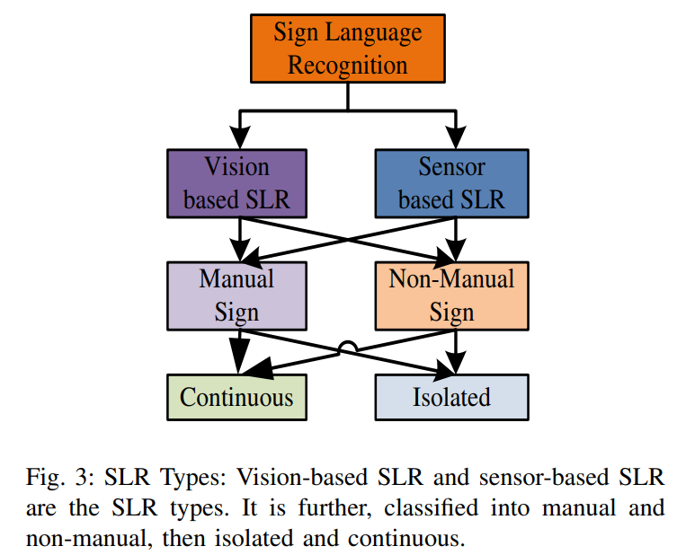

As for vision-based method, below are 3 method needed to improve the accuracy.

#### preprocessing

| method                                          | function                                                     | example                       |
| ----------------------------------------------- | ------------------------------------------------------------ | ----------------------------- |
| image reduction and image conversion            | reduce the burden of data processing                         |                               |
| histogram equalization                          | remove the unwanted object                                   |                               |
| filter                                          | remove the noise present in the picture                      | mefian, moving average method |
| gaussian average method                         | remove the image background component                        |                               |
| image edge detection algorithm(used in filters) | remove the unwanted components and minimize the size of the data |                               |
| fast Fourier transformation(used in filters)    | can speed up the filters                                     |                               |
| segmentation                                    | improve processing                                           | masking                       |
| binarization histogram equalization             | elimination of background effect and for better image contrast |                               |
| normalization method                            | handle the variance in the data                              |                               |

- histogram equalization

Histogram equalization is a method used to improve the contrast of an image by redistributing the intensity values. It works by mapping the original intensity values to new values that spread the histogram over the entire intensity range. 

#### feature extraction

methods

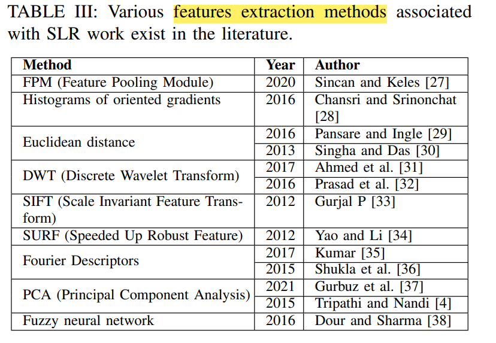

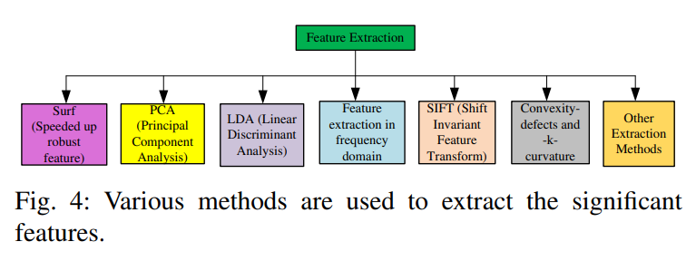

along with the above methods, functions that reduce the feature vector dimension is also necessary. And these functions are like PCA, LDA, etc.

Principal Component Analysis (PCA) is a technique used to transform correlated data into uncorrelated data.

### Sec3 literature study about SLR

Ordinary people also communicate information in the noisy area of public places and the library without disturbing others. **Manuel** (communication by hands) and **non-manual** (communication by body posture or facial expression) medium are usually used in sign language.

#### Manual SLR

Here is the diagram representing the manual components:

[You can edit this diagram online if you want to make any changes.](https://showme.redstarplugin.com/s/F72kmt0L)

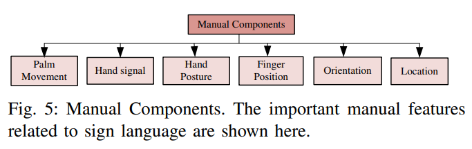

The manual SLR is classified into isolated and continuous.

**classical methods:**(mostly the machine learning methods)

1. sequential Pattern Tree-based multi-class classifier performs better than the Hidden Markov Model.
2. data fusion incurred ANN-based Thai SLR model. did classification using a back-propagation algorithm associated with an ANN
3. Yin et al. [52] BP and template matching method combination. With  computation time as 0.0134 and an accuracy of 99.8%. isolated hand gesture recognition.
4. Jane and Sasidhar [53]: ANN classifier with association of data fusion. three hidden layers ANN with wavelet denoising and TKEO(TeagerKaiser energy operator). 93.27%.
5. ANN [11] varying dataset size (50 to 1500) and classifier (1 to 10).  97.4 % recognition accuracy
6. Almeida et al. [54]TODO and next time focus on deep learning method than classic method.
6. Chinese Sign language recognition + sensor fusion decision tree and Multi-Stream Hidden Markov Models classifier

**deep learning method**

1. single and fusion parallel 3D CNN. [46]
2. CNN+ LSTM for Turkish SLR[27]. Also with FPM(feature pooling module) to improve feature extraction and attention model to speed up convergence
3.  DCNN(deep convolution)+ LSTM for hand gesture recognition[24]. And use residual module overcome the gradient vanishing and overfitting problem. Using DFFN() to solve gesture long-distance dependency problem?, which is way more better than other network.
4.  BiLSTM(deep Bi-directional Long Short Term Memory recurrent neural network) for Arabic SLR model. Using Convolutional Self-Organizing Map for hand shape feature extraction, DeepLabv3+ for hand regions extrations[2]. Model is suitable for an isolated sign, continuous sign based analysis.
5. SSD(Single Shot Detector), 2DCNN, 3DCNN and LSTM based pipe-line architecture were proposed to recognize the hand sign language automatically[3]2020. This is a multi-modal hand skeleton-based SLR model.

Attention: before choosing a method, referring Table4 first(time, pros and cons). 

#### Continuous Manual SLR

Important! Higher priority than others!(Most closest to our environment)

Is more complex for there is no clear pause after each gesture.

1. traditional method

- PCA+ short term Foutier transform+ RBF(radial basis function) associated SVM. Contactless sensing and environment independent. Test on 20 signs, 7 subjects[37]2021.

1. Cross model based related work on continuous manual SLR

- 3DCNN+ FC-RNN to localize the continuous video temporal boundaries, SVM to recognize sign actions[66]2018.
- 3DCNN(MLP and auto encoder-based feature extracted)+ an open pose framework to capture hand feature[23]2020
- examined the performance of three models: time-LeNet, t-LeNet(time), and MC-DCNN[67]2020
- spatial and temporal fused Attention incurred Bi directional long term memory network. And Multi-Plane Vector Relation(MPVR) is used to get skeletal features[68]2020.
- a cross-model learning-based continuous model, and proved validity with **three public datasets**[69]2020

More information of different methods in Table5 and Figure7.

#### Non-Manual SLR

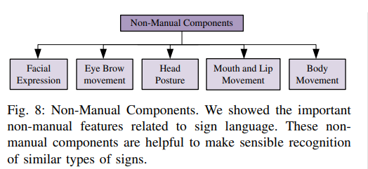

The non-manual SLR can also be classified as isolated and continuous. Since there is little emphasis on hand gesture recognition in this part, it can be left as is.

### Sec4 Classification architectures

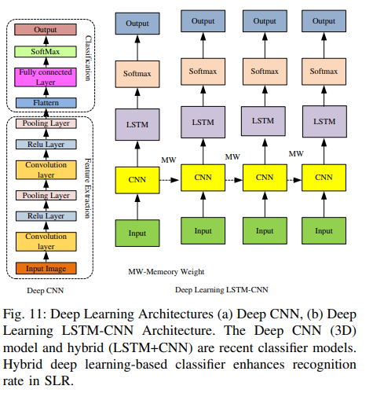

- ANN

like back propagation, multi-layer and recurrent neural networks

but handling large data is difficult

- HMM

complication:

1. likelihood of observation
2. best hidden state sequence decoding
3. HMM, parameter framing

- 2DCNN

drawback: parameter need for 2DCNN is excessively more, which makes the design process complex

- 3DCNN

spatio-temporal data has directly represented hierarchically

but concerns to the long-term temporal dependence sign capturing 3DCNN cannot assure robustness.

- LSTM

eliminate the long-term dependence problem

- hybrid-based approach

can improve the accuracy

**A. Traditional architectures**

TODO 5.14

### Sec5 Different types of sensing approach

### Sec6 Discusstion

### Sec7 Future direction and research score

### Sec8 Conclusion

# Federated learning

Thank you for sharing the link. This article is titled "Federated Learning for Mobile Keyboard Prediction" and was published in the Proceedings of the ACM on Interactive, Mobile, Wearable and Ubiquitous Technologies in 2021. It discusses how federated learning can be used to improve mobile keyboard prediction while preserving user privacy. Is there anything specific you would like to know about this article?

Mobile keyboard prediction refers to the ability of a mobile device’s keyboard to predict and suggest the next word or phrase a user is likely to type based on their previous input. Improving mobile keyboard prediction means increasing the accuracy and relevance of these predictions, making it easier and faster for users to type on their mobile devices. Federated learning can be used to train machine learning models on data from multiple users’ devices without compromising their privacy, allowing for more accurate and personalized predictions.

## 1. Characterizing Impacts of Heterogeneity in Federated Learning upon Large-Scale Smartphone Data. 

total citation:20 download:546

Chengxu Yang, Qipeng Wang, Mengwei Xu, Zhenpeng Chen, Kaigui Bian, Yunxin Liu, and Xuanzhe Liu. 2021. Characterizing Impacts of Heterogeneity in Federated Learning upon Large-Scale Smartphone Data. In Proceedings of the Web Conference 2021 (WWW ’21), April 19–23, 2021, Ljubljana, Slovenia. ACM, New York, NY, USA, 12 pages. https://doi.org/10.1145/3442381.3449851

>计算异构性是指什么？常出现在什么场景下？

计算异构性（computational heterogeneity）指的是在计算机系统中，不同类型、不同结构、不同规模、不同性能的计算资源之间存在的差异性和不同。这些计算资源可以包括不同的处理器、存储设备、网络带宽等。计算异构性通常会对计算机系统的性能、可靠性、可扩展性等方面产生影响。

计算异构性常常出现在大规模计算、分布式计算、云计算、并行计算、深度学习、机器学习等领域。在这些场景下，由于数据集和计算任务的复杂性和规模越来越大，需要利用多种不同类型的计算资源来提高计算效率和处理能力。例如，在深度学习领域，需要同时利用 CPU、GPU、FPGA 等异构计算资源，以提高训练和推理的速度和效率。在分布式计算和云计算中，计算节点的异构性往往是由于各个节点所使用的硬件或操作系统版本不同，或者由于使用不同的编程语言或框架而导致的。针对这些异构性，需要采用异构计算技术来优化计算和通信流程，提高系统的性能和可靠性。

公开数据集：[PKU-Chengxu/FLASH (github.com)](https://github.com/PKU-Chengxu/FLASH)

### abstract

**heterogeneity**: resides in the various hardware specifications and dynamic states across the participating devices. And have a influence, such as causing a device unavailable for training or unable to uploads its model updates.

using a large-scale data from 136k smartphones that can faithfully reflect the heterogeneity

a heterogeneity-aware FL platform

extensive experiments to compare the performance of SOTA FL algorithm

Results:

- heterogeneity causes non-trivial performance degradation 
- two potential factors: device failure and participant bias

### keywords

Federated learning; heterogeneity; measurement study

### introduction

- background

the increase of machine learning(ML) applications deployed on mobile deices. With the privacy concern, FL has drawn tremendous attentions. **The key idea**: to employ a set of personal mobile devices to train an ML model collaboratively协同 under the orchestration协调 of a central parameter server中央参数服务器. And the training process of FL takes place on mobile devices(i.e. on-device training) wtihout uploading user personal data outside devices.

As for the evaluation of the algorithms, typically carried out in a simulation approach and using the high cost of real deployment which only gives an overly ideal assumption.(i.e., all the devices are always available for training and equipped, with homogeneous hardware specifications)

- problem

hetetogeneity: 

1. hardware specifications of devices
2. various state and running environment of participating deices

- experiments

collecting the device hardware specification and regular state changes of 136k smartphones and plug these data into their heterogeneity-aware platform to simulate the device and state dynamics and hardware capacity.

extensive measurements experiments: select 4 typical FL tasks: two image classification tasks and two natural language processing tasks.

- results and analysis

results:

1. hinders the algorithm from addressing the fairness issues in FL
2. can hardly speed up FL convergence under heterogeneity aware settings

analysis:

1. device failure: fail to upload their model updates per round
2. participant bias: 30% will never participate in when the model converges and the global model is dominated by active devices

- contributions

1. build a heterogeneity-aware FL platform with a large-scale dataset collected from 136k smartphones, which can help simulate the state and hardware heterogeneity for exploring FL in real-world practice.s
2. conduct extensive measurement experiments to demystify阐明 the non-trivial深远的 impacts of heterogeneity in existing FL algorithms.

## 2. A Privacy-Preserving Federated Learning System for Android Malware Detection Based on Edge Computing

Hsu, Ruei-Hau, et al. "A privacy-preserving federated learning system for android malware detection based on edge computing." *2020 15th Asia Joint Conference on Information Security (AsiaJCIS)*. IEEE, 2020.

total citation: 18

### keywords

Android malware, Privacy-preserving federated learning, Support vector machine, Data privacy, Secure multiparty computation

### abstract

PPFL: a privacy-presserving federated learning system for the detection of android malware. Allowing mobile devices to collaborate together for training a classifier without exposing the sensitive information: API and learned local model. **Based on** SVM and secure multi-party computation techniques.

Datasets: Android malware datasets provided by NICT

experiments: compare the performance of PPFL and that of centralized training system for the use case:

1.  different data set
2. different features on distinct mobile phone

the first Android malware detection system based on privacy-preserving federated learning system.

### introduciton

- background

popularity of android system: in the second quarter of 2018, android is the most widely used mobile operating system with 88% of the global mobile phone market. And because of the android open specification, android application markets are easier to be attacked.

As a result, it is expected that the dramatic increase in the number of mobile malware. Two features are usually used for malware detection: 1. permissions 2. API calls

Mainstream of the machine learning techniques is SVM and KNN. But there are several legislation regarding the protection of personal data privacy.

A federated learning framework is a practical solution for the training of distributed data cooperatively. 

- proposed system

the main idea of federated learning is that mobile devices collaboratively train a global model and the raw training data would not be known to the server. Because mobile devices just send model parameters to the server. Using FL has 2 **benefits**: 1. protecting data privacy 2. saving network traffic. Federated learning and centralized learning overview are depicted in Fig.1, respectively. 

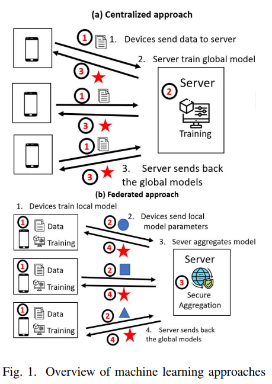

And this work proposes a system architecture for exploiting the computing resources provided by edge computing(shown in Fig.2) infrastructure for lower latency and decentralized data analytics in 5G.

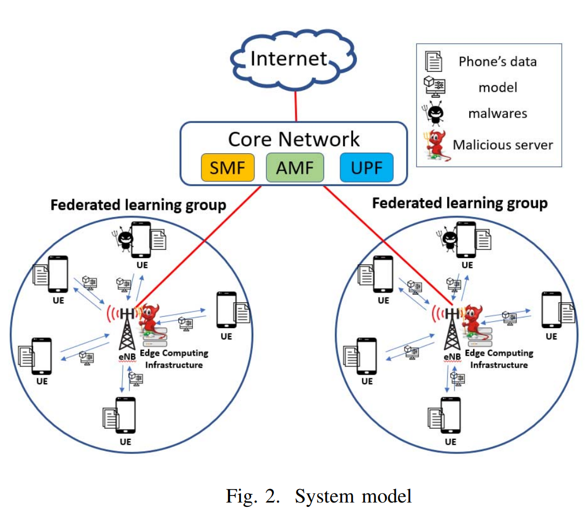

- contributions

1. We proposed a novel Android malware detection approach that uses static analysis and meta-data analysis with privacy-preserving federated learning. To the best of our knowledge, this work is the **first** implementation of privacy-preserving federated learning for Android malware detection.
2. We designed a system **architecture based on edge computing** to reduce latency and protect data against honest-but-curious service operators.
3. We conduct experiments in different aspects to evaluate the performance of our proposed PPFL system. The result show that federated learning can perform almost the same accuracy with an identical amount of data compared to the traditional centralized machine learning systems. 

# Question

> what's the difference between keywords and CCS CONSEPTS in a paper?

Keywords and CCS concepts are both used to categorize and identify the main topics and themes in a research paper, but they are used in different ways.

**Keywords** are specific words or phrases that are included in the manuscript and listed at the end of the abstract or introduction section. They are meant to provide a quick summary of the main topics, methods, and results of the study, and to help readers find relevant articles when searching databases or online platforms. Keywords are usually chosen by the authors themselves and can be broad or narrow, depending on the focus of the study.

**CCS concepts**, on the other hand, are a standardized set of subject categories developed by the Association for Computing Machinery (ACM) to describe research topics in computer science and related fields. CCS concepts are used to classify papers in academic databases and search engines, and they provide a hierarchical and standardized way to categorize research topics. Unlike keywords, which are chosen by the authors, CCS concepts are assigned by the database or search engine based on the content of the paper, and they can be more specific and detailed than keywords.

In summary, keywords are specific words or phrases chosen by the authors to summarize the main topics and themes of their paper, while CCS concepts are standardized subject categories used to classify research papers in academic databases and search engines.

# TODO

[Federated learning review: Fundamentals, enabling technologies, and future applications - ScienceDirect](https://www.sciencedirect.com/science/article/abs/pii/S0306457322001649)

[Privacy-Preserving Continuous Authentication for Mobile and IoT Systems Using Warmup-Based Federated Learning | IEEE Journals & Magazine | IEEE Xplore](https://ieeexplore.ieee.org/abstract/document/9852378)

- [ ] FL 文章的关键词，尝试替换成： Android , federated learning

[A comprehensive survey and taxonomy of sign language research - ScienceDirect](https://www.sciencedirect.com/science/article/abs/pii/S0952197622002925)

The main findings of the survey **A comprehensive survey and taxonomy of sign language research** by El-Sayed M. El-Alfy and Hamzah Luqman are that it provides a taxonomy and review of the body of knowledge and research efforts with focus on acquisition devices, available databases, and recognition techniques for fingerspelling signs, isolated sign words, and continuous sentence recognition systems⁴.

El-Alfy, El-Sayed M., and Hamzah Luqman. "A comprehensive survey and taxonomy of sign language research." *Engineering Applications of Artificial Intelligence* 114 (2022): 105198.

----

- [ ] Gesture recognition: Since **RNN** is widely used in the processing of time-series data, we can focus on the use of RNN in SLR. And based on Mediapipe, the most difficult problem is skeleton recognition, e.g. the software launched by Keep company can recognize the body posing.
- [ ] As language models such as ChatGPT are becoming increasingly popular, exploring the use of federated learning in model training is also gaining popularity.
- [ ] survey on transfer learning

1. A Concise Review of Transfer Learning

2021

The paper "A Concise Review of Transfer Learning" by Abolfazl Farahani et al. aims to give a concise review of traditional and current transfer learning settings, existing challenges, and related approaches¹. The paper discusses how transfer learning can boost the performance of a target learner by applying another related source data. In contrast to traditional machine learning and data mining techniques, which assume that the training and testing data lie from the same feature space and distribution, transfer learning can handle situations where there is a discrepancy between domains and distributions¹.

文章提供了对传统和当前迁移学习的设置、现存挑战以及相关方法的详细介绍。文章讨论了迁移学习是如何使用另一个相关源数据提升目标的性能。和传统的机器学习以及数据挖掘算法比较，这些方法需要数据在相同的特征空间和分布中。迁移学习能够处理领域和分布存在差异的数据。

The paper's contribution is that it provides a concise review of traditional and current transfer learning settings, existing challenges, and related approaches. It also discusses how transfer learning can be used to utilize available related source data and extend the underlying knowledge to the target task achieving better performance¹.

文章的贡献是，提供了对传统和当前迁移学习设置、现存挑战和相关方法的详细介绍。文章同样讨论了迁移学习如何使用可获得的相关数据扩展对目标任务的潜在知识从而获得更好的表现。

I hope this helps!

Source: Conversation with Bing, 2023/5/13
(1) [2104.02144] A Concise Review of Transfer Learning - arXiv.org. https://arxiv.org/abs/2104.02144.
(2) A Concise Review of Transfer Learning - arXiv.org. https://arxiv.org/pdf/2104.02144.

---

- [ ] 

- [ ] survey on few-shot learning

- [ ] survey on meta-learning

- [ ] survey on domain adaptation

1. A Comprehensive Survey on Source-free Domain Adaptation

2023

The paper "A Comprehensive Survey on Source-free Domain Adaptation" by Zhiqi Yu et al. provides a comprehensive survey of recent advances in Source-Free Domain Adaptation (SFDA) and organizes them into a unified categorization scheme based on the framework of transfer learning¹. The paper discusses how conventional domain adaptation methods often assume access to both source and target domain data simultaneously, which may not be feasible in real-world scenarios due to privacy and confidentiality concerns. As a result, the research of SFDA has drawn growing attention in recent years, which only utilizes the source-trained model and unlabeled target data to adapt to the target domain¹.

文章对源域无关适应最新进展进行了详细的调查，并根据迁移学习框架组织成统一的分类方案。文章讨论了传统的领域适应方法通常假设同时访问源域和目标域数据，但是在现实生活中因为隐私和机密性问题而不可行。最后，最近在SFDA领域的研究引起相当关注，它仅使用源域训练的模型和无标签的数据适应目标域。

The paper's contribution is that it provides a comprehensive survey of recent advances in SFDA and organizes them into a unified categorization scheme based on the framework of transfer learning. Instead of presenting each approach independently, the authors modularize several components of each method to more clearly illustrate their relationships and mechanics in light of the composite properties of each method. Furthermore, they compare the results of more than 30 representative SFDA methods on three popular classification benchmarks, namely Office-31, Office-home, and VisDA, to explore the effectiveness of various technical routes and the combination effects among them¹.

论文的贡献在于对SFDA最新进展进行了全面的调查。并且将他们组织成了统一的分类方案。作者没有单独呈现每种方法，而是将每种方法的几个组成部分模块化，更清楚阐明他们之间的关系与机制。此外，他们比较了30多种代表性的SFDA方法以及在三个常用的分类测试基准上进行测试，分别是Office-31、Office-home和Visda，以探索各种技术路线和他们之间的组合效果。

I hope this helps!

Source: Conversation with Bing, 2023/5/13
(1) A Comprehensive Survey on Source-free Domain Adaptation. https://arxiv.org/abs/2302.11803.
(2) A COMPREHENSIVE SURVEY ON SOURCE-FREE DOMAIN ADAPTATION 1 A ... - arXiv.org. https://arxiv.org/pdf/2302.11803.pdf.
(3) A Comprehensive Survey on Source-free Domain Adaptation. http://export.arxiv.org/abs/2302.11803.
(4) A Comprehensive Survey on Source-free Domain Adaptation - Semantic Scholar. https://www.semanticscholar.org/paper/A-Comprehensive-Survey-on-Source-free-Domain-Yu-Li/449859b4a14f96403e6819a3e2d7060fc7ffd512.

---

- [ ] relevant work on framework

[Continuous sign language recognition using isolated signs data and deep transfer learning | SpringerLink](https://link.springer.com/article/10.1007/s12652-021-03418-z)

The paper you mentioned is titled "Continuous sign language recognition using isolated signs data and deep transfer learning" by S. Sharma, R. Gupta & A. Kumar. This paper proposes **a deep transfer learning approach** for recognition of sign sequence in sentences continuously signed in the Indian sign language using **sufficient labelled data of isolated signs** and **limited amount of labelled sentence data**. The data is collected using multiple six degree-of-freedom inertial measurement units (IMUs) on both hands of the signer. The proposed deep learning model consists of a convolutional neural network (CNN), two bidirectional long short-term memory (Bi-LSTM) layers and connectionist temporal classification (CTC) to enable end-to-end sentence recognition without requiring the knowledge of sign boundaries¹.

你提到的论文标题是《使用孤立符号数据和深度迁移学习进行连续手语识别》（Continuous sign language recognition using isolated signs data and deep transfer learning），作者是S. Sharma，R. Gupta和A. Kumar。本文提出了一种深度迁移学习方法，用于使用足够标记的孤立符号数据和有限数量标记的句子数据，在印度手语中连续识别句子中的手语序列。数据是使用多个六自由度惯性测量单元（IMU）在发言者的双手上收集的。所提出的深度学习模型包括卷积神经网络（CNN），两个双向长短期记忆（Bi-LSTM）层和连续时间分类（CTC），以实现端到端的句子识别，而无需知道手语边界¹。

[2103.05111.pdf (arxiv.org)](https://arxiv.org/ftp/arxiv/papers/2103/2103.05111.pdf)

Application of transfer learning to sign language recognition using an inflated 3D deep convolutional neural network

The first paper you mentioned is titled “Application of Transfer Learning to Sign Language Recognition using an Inflated 3D Deep Convolutional Neural Network” by Roman Töngi. This paper investigates how effectively transfer learning can be applied to isolated sign language recognition (SLR) using an inflated 3D convolutional neural network as the deep learning architecture. Transfer learning is implemented by pre-training a network on the American Sign Language dataset MS-ASL and subsequently fine-tuning it separately on three different sizes of the German Sign Language dataset SIGNUM. The results of the experiments give clear empirical evidence that transfer learning can be effectively applied to isolated SLR. [The accuracy performances of the networks applying transfer learning increased substantially by up to 21% as compared to the baseline models that were not pre-trained on the MS-ASL dataset](https://arxiv.org/abs/2103.05111)[1](https://arxiv.org/abs/2103.05111).

第一篇论文的题目是“应用迁移学习到手语识别中：基于充气式三维深度卷积神经网络的研究”，作者是Roman Töngi。该论文研究了如何有效地应用迁移学习到孤立手语识别中，使用充气式三维卷积神经网络作为深度学习架构。迁移学习通过在美国手语数据集MS-ASL上预训练网络，然后在三个不同大小的德国手语数据集SIGNUM上分别微调。实验结果明确表明，迁移学习可以有效地应用于孤立手语识别。应用迁移学习的网络的准确性性能相对于没有在MS-ASL数据集上预训练的基准模型显著提高，增加了高达21%。

---

- [ ] survey on federated learning

[Recent Advances on Federated Learning: A Systematic Survey (arxiv.org)](https://arxiv.org/pdf/2301.01299.pdf)

2023.1

The first paper you mentioned is titled "Recent Advances on Federated Learning: A Systematic Survey" by Bingyan Liu, Nuoyan Lv, Yuanchun Guo, and Yawen Li. This paper provides a systematic survey on federated learning and aims to review the recent advanced federated methods and applications from different aspects. Specifically, this paper includes four major contributions: presenting a new taxonomy of federated learning in terms of the pipeline and challenges in federated scenarios; summarizing federated learning methods into several categories and briefly introducing the state-of-the-art methods under these categories; overviewing some prevalent federated learning frameworks and introducing their features; and discussing some potential deficiencies of current methods and several future directions¹.

您提到的第一篇论文题为“联邦学习的最新进展：系统性调研”，作者为Bingyan Liu、Nuoyan Lv、Yuanchun Guo和Yawen Li。该论文对联邦学习进行了系统性的调研，旨在从不同的方面回顾最近的高级联邦方法和应用。具体而言，该论文包括四个主要贡献：提出了一个新的联邦学习分类法，以管道和联邦场景中的挑战为基础；将联邦学习方法总结为几类，并简要介绍了这些类别下的最新方法；概述了一些流行的联邦学习框架并介绍了它们的特点；讨论了当前方法的一些潜在缺陷和几个未来的研究方向¹。

[A survey on federated learning: challenges and applications | SpringerLink](https://link.springer.com/article/10.1007/s13042-022-01647-y)

The first paper you mentioned is titled “A survey on federated learning: challenges and applications” by Jie Wen, Zhixia Zhang, Yang Lan, Zhihua Cui, Jianghui Cai & Wensheng Zhang. This paper systematically introduces the current researches in federated learning (FL) from five aspects: the basics knowledge of FL, privacy and security protection mechanisms in FL, communication overhead challenges and heterogeneity problems of FL. [Furthermore, the paper makes a comprehensive summary of the research in practical applications and prospects the future research directions of FL](

篇论文系统地介绍了联邦学习（FL）的五个方面的研究内容：FL的基础知识、FL中的隐私和安全保护机制、FL中的通信开销挑战以及FL中的异构性问题。此外，论文还对FL在实际应用方面的研究进行了全面的总结，并展望了FL未来的研究方向。

---

